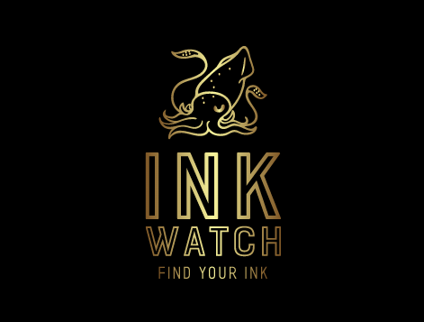

# Ink-Watch

## Description
Want to take your tattoo search up a notch? Use Ink Watch! This social media site is made for those wanting to share their tattoos or look for a new tattoo artist.

## Table of Contents
- [Installation](#installation)
- [Usage](#usage)
- [Credits](#credits)
- [License](#license)
- [Technologies](#technologies)
- [Links](#links)
- [Image](#image)

## Installation
N/A

## Usage
To start the generator, write "node index" into the terminal and press enter. From there, you will be prompted with different questions. Write your answers into the terminal and enter them. From there, a newREADME.md file will be made with your answers formatted.

## Credits
N/A

## License

## Technologies

## Links
- [GitHub-Repo](https://github.com/wobbledy/ink-watch.git)
- [Live-Site](https://inkwatch.herokuapp.com/)

## Image

